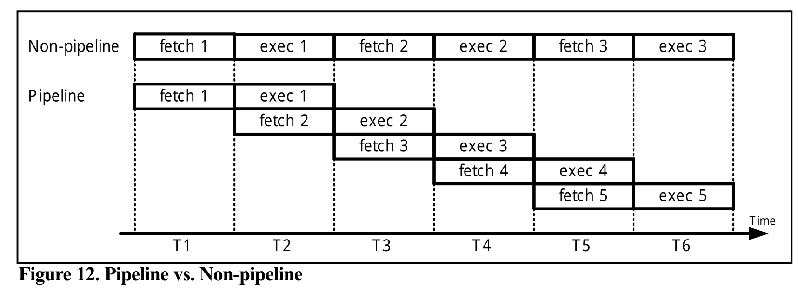

# Chapter 4: Branch, Call and Timing

This chapter covers branching instructions, subroutine calls with stack operations, and timing delay calculations in AVR microcontrollers.

---

## Table of Contents
1. [Branching and Looping](#1-branching-and-looping)
2. [Call Instructions and Stack](#2-call-instructions-and-stack)
3. [Time Delay and Instruction Pipeline](#3-time-delay-and-instruction-pipeline)

---

## 1. Branching and Looping

### Conditional Branch Instructions

**BRNE (Branch If Not Equal)**

Branches to the target address if the Zero flag (Z) = 0.

```assembly
BACK:   ....
        ....
        ....
        DEC Rn
        BRNE BACK       ; Repeat until Rn = 0 (Z = 1)
```

**Example: Clear R20, add 3 to R20 ten times, send sum to PORTB**

```assembly
LDI R16, 10         ; R16 = 10 (decimal) for counter
LDI R20, 0          ; R20 = 0
LDI R21, 3          ; R21 = 3
AGAIN: ADD R20, R21 ; add 3 to R20 (R20 = sum)
DEC R16             ; decrement R16 (counter)
BRNE AGAIN          ; repeat until COUNT = 0
OUT PORTB, R20      ; send sum to PORTB
```

### Loop Inside a Loop

**What is a Nested Loop?**

A nested loop is a loop inside another loop. The **inner loop** completes all its iterations for each single iteration of the **outer loop**. This technique is extremely useful when you need to create longer delays or perform repetitive tasks multiple times.

For example, if the outer loop runs 10 times and the inner loop runs 70 times, the inner loop body executes a total of **10 × 70 = 700 times**.

**Example: Load PORTB with 0x55 and complement it 700 times**

Let's say we want to toggle the bits of PORTB 700 times. Instead of using a single counter that counts to 700, we can use two nested loops: an outer loop that runs 10 times and an inner loop that runs 70 times.

```assembly
LDI R16, 0x55       ; R16 = 0x55
OUT PORTB, R16      ; PORTB = 0x55
LDI R20, 10         ; load 10 into R20 (outer loop count)
LOP_1: LDI R21, 70  ; load 70 into R21 (inner loop count)
LOP_2: COM R16      ; complement R16
OUT PORTB, R16      ; load PORTB SFR with the complemented value
DEC R21             ; dec R21 (inner loop)
BRNE LOP_2          ; repeat it 70 times
DEC R20             ; dec R20 (outer loop)
BRNE LOP_1          ; repeat it 10 times
```

### Other Conditional Branches

**BREQ (Branch If Equal)**

Branch if Z = 1. The Zero flag is checked, and if it is high, the CPU jumps to the target address.

```assembly
OVER: IN R20, PINB
TST R20
BREQ OVER           ; Loop until R20 is not zero
```

**BRSH (Branch If Same or Higher)**

Branch if Carry flag (C) = 0.

### Branch Instruction Characteristics

* All conditional jumps must have a target within **64 bytes** of the Program Counter.
* All conditional jumps are **2-byte instructions**.

---

### Unconditional Jump Instructions

**JMP (Unconditional Long Jump)**

* Can jump to any memory location (4M words).
* **4-byte instruction** (10 bits for opcode, 22 bits for address location).
* Can address locations from `0x000000` to `0x3FFFFF`.

```assembly
JMP TARGET          ; Jump to TARGET anywhere in memory
```

**RJMP (Relative Jump)**

* **2-byte instruction** (4 bits opcode, 12 bits for relative address).
* Can jump within **−2048 to +2047 words** of memory relative to the current PC.
* Address range: `0x000` to `0xFFF`.

```assembly
RJMP NEARBY         ; Jump to NEARBY within ±2K words
```

---

### Jump Instructions Comparison

| Instruction | Type | Size | Range | Use Case |
|------------|------|------|-------|----------|
| **BRNE, BREQ, BRSH** | Conditional Branch | 2 bytes | ±64 bytes | Short conditional jumps within nearby code |
| **JMP** | Unconditional Jump | 4 bytes | 4M words (entire memory) | Long jumps to any location in program memory |
| **RJMP** | Relative Jump | 2 bytes | ±2K words (±2048 words) | Short jumps within local code sections |
| **IJMP** | Indirect Jump | 2 bytes | Any location via Z-register | Dynamic jumps (switch-case, function tables) |

**Key Differences:**
* **Conditional vs Unconditional**: Conditional branches check flags (Z, C, etc.); unconditional jumps always execute.
* **Size**: Larger instructions (4 bytes) can reach farther but consume more memory.
* **Speed**: Smaller instructions are generally faster and more efficient.
* **Flexibility**: Indirect jumps (IJMP) offer runtime flexibility but require setup.

---

**IJMP (Indirect Jump)**

* Sends the processor to an address stored in the **Z-register (R31:R30)**.
* Allows the code to decide where to go while the program is running.
* Perfect for **switch-case blocks** and **function pointers**.
* **2-byte instruction**.

### Understanding the Z-Register

The **Z-register** is a 16-bit register pair formed by combining two 8-bit registers:
* **ZH (Z-High)** = R31 (holds the high byte of the address)
* **ZL (Z-Low)** = R30 (holds the low byte of the address)

The Z-register is used for **indirect addressing**, meaning it holds a memory address that points to where the CPU should jump or read/write data.

### IJMP Example

```assembly
; Jump to byte address 0x0150
LDI ZH, 0x01        ; Load high byte (0x01)
LDI ZL, 0x50        ; Load low byte (0x50)
IJMP                ; Jump to address 0x0150
```

---

## 2. Call Instructions and Stack

### CALL (Long Call)

* **4-byte instruction** (10 bits opcode, 22 bits address).
* Used to call subroutines located anywhere within the **4M address space** (`0x000000` to `0x3FFFFF`).
* The microcontroller automatically saves the return address (address of the instruction immediately after CALL) on the stack.

### Why Do We Need CALL?

A **subroutine** (also called a function) is a reusable block of code that performs a specific task. Instead of writing the same code multiple times, you write it once as a subroutine and **call** it whenever needed.

**Benefits:**
* **Code Reusability**: Write once, use many times.
* **Modularity**: Break complex programs into smaller, manageable pieces.
* **Easier Debugging**: Test and fix one function at a time.

### Simple CALL Example

```assembly
; Main program
.ORG 0x0000
    LDI R16, HIGH(RAMEND)   ; Initialize stack pointer
    OUT SPH, R16
    LDI R16, LOW(RAMEND)
    OUT SPL, R16
    
    LDI R20, 5              ; Load R20 with 5
    LDI R21, 10             ; Load R21 with 10
    CALL ADD_NUMBERS        ; Call subroutine to add numbers
    OUT PORTB, R22          ; Send result to PORTB
    RJMP END                ; End program

; Subroutine: Add two numbers
ADD_NUMBERS:
    ADD R22, R20            ; R22 = R20 + R21
    ADD R22, R21
    RET                     ; Return to caller

END:
    RJMP END                ; Infinite loop
```

**What happens:**
1. Main program loads values into R20 and R21.
2. `CALL ADD_NUMBERS` saves the return address on the stack and jumps to the subroutine.
3. Subroutine adds the numbers and stores the result in R22.
4. `RET` pops the return address from the stack and returns to the main program.
5. Result is sent to PORTB.

### Stack Initialization

**To use CALL, you must initialize the Stack Pointer (SP) with the highest RAM location (RAMEND):**

* When **pushing** to the stack, SP is **decremented**.
* When **popping** from the stack, SP is **incremented**, then the value is loaded into the register.
* SP has two registers: **SPH** (high byte) and **SPL** (low byte).

```assembly
LDI R16, HIGH(RAMEND)   ; Load high byte of RAMEND
OUT SPH, R16            ; Initialize SPH
LDI R16, LOW(RAMEND)    ; Load low byte of RAMEND
OUT SPL, R16            ; Initialize SPL
```


### How CALL Works

1. When a subroutine is **called**, the processor saves the address of the instruction immediately after the CALL on the stack.
2. For the **ATmega32**, whose program counter is 16 bits or less, the PC is broken into 2 bytes:
   - **High byte** is pushed first.
   - **Low byte** is pushed second.
3. Control is transferred to the subroutine.
4. At the end of the subroutine, the **RET** instruction is executed.
5. When **RET** executes, the top 2 bytes of the stack are popped back into the PC, and SP is incremented.

**Important Notes:**
* The stack **must not** be defined in register memory (0x00–0x1F) or I/O memory (0x20–0x5F). It must be in SRAM (`>= 0x60`).
* In AVR, the stack is used for **calls** and **interrupts**.

### Complete CALL Example


This diagram shows:
* How the Program Counter (PC) is saved on the stack when CALL is executed.
* How the stack pointer (SP) changes during PUSH and POP operations.
* How RET restores the PC and returns to the instruction after the CALL.

---

### RCALL (Relative Call)

* **2-byte instruction** (12 bits for the address).
* Similar to CALL, but with a **shorter range**.
* The only difference is the scope: RCALL has a limited address range compared to CALL.

**Example:**
```assembly
; Main program
MAIN:
    LDI R16, 0xFF
    RCALL DELAY         ; Call delay subroutine (must be within ±2K words)
    OUT PORTB, R16
    RJMP MAIN

; Delay subroutine
DELAY:
    LDI R18, 255
DELAY_LOOP:
    DEC R18
    BRNE DELAY_LOOP
    RET                 ; Return to caller
```

**When to use RCALL vs CALL:**
* Use **RCALL** when the subroutine is nearby (saves 2 bytes of memory per call).
* Use **CALL** when the subroutine is far away or when writing large programs.

---

### ICALL (Indirect Call)

* The "call" version of the **IJMP** instruction.
* Instead of just jumping, it treats the destination like a **subroutine**.
* **Saves the return address**: Pushes the current PC onto the stack.
* **Jumps to the Z-pointer**: Loads the address stored in the Z-register (R31:R30) into the PC.

### ICALL Example

```assembly
; Simple direct call using known byte address
; Call function at byte address 0x0200
LDI ZH, 0x02        ; Load high byte (0x02)
LDI ZL, 0x00        ; Load low byte (0x00)
ICALL               ; Call function at address 0x0200
; ... code continues after RET
```

**Use Case**: ICALL is perfect for implementing **function dispatch tables**, where you select which function to call based on a variable or user input (like a menu system).

---

## 3. Time Delay and Instruction Pipeline

### What is a Delay?

A **delay** is intentionally wasting CPU time, typically used to create pauses in program execution (e.g., for LED blinking, sensor debouncing, or timing control).

### Crystal Frequency

* To calculate delays, you must know the **frequency of the crystal oscillator** connected to the **XTAL1** and **XTAL2** input pins.
* The duration of the clock period for the instruction cycle is a function of this crystal frequency.

---

### How AVR Executes Instructions in One Clock Cycle

The AVR architecture uses three core design strategies:

1. **Harvard Architecture**: Separate memory paths and buses for program code and data, allowing simultaneous access.
2. **RISC Principles**: Fixed-size instructions for streamlined execution.
3. **Pipelining**: Overlaps execution stages so that while one instruction is executing, the next instruction is being fetched.

### Pipelining Explained

* In early microprocessors like the **8085**, the CPU could either **fetch** or **execute** at a given time.
* The idea of **pipelining** allows the CPU to **fetch and execute simultaneously**, increasing execution speed.
* Instructions are executed in **3 stages**:
  1. **Operand Fetch**
  2. **ALU Operation Execution**
  3. **Result Write Back**


With pipelining, while one instruction is in the execution stage, the next instruction is already being fetched.




---

### Instruction Timing

* All instructions in the AVR are either **1-word (2 bytes)** or **2-word (4 bytes)**.
* Most instructions take **no more than two machine cycles**.
* The length of the machine cycle depends on the **oscillator frequency**.
* The crystal oscillator, along with on-chip circuitry, provides the clock source for the AVR CPU.

**Formula:**
```
One machine cycle = One oscillator period
```

---

### Example: Instruction Cycle Calculation

Find the period of the instruction cycle for the following crystal frequencies:

| Frequency | Instruction Cycle |
|-----------|-------------------|
| 8 MHz     | 1/8 MHz = 0.125 μs = 125 ns |
| 16 MHz    | 1/16 MHz = 0.0625 μs = 62.5 ns |
| 10 MHz    | 1/10 MHz = 0.1 μs = 100 ns |
| 1 MHz     | 1/1 MHz = 1 μs |

---

### Impact of Pipelining on Instruction Timing

**One-Cycle Instructions:**
* Standard operations (like `ADD` or `MOV`) take **1 cycle** because the next instruction is always ready.

**Two-Cycle (or More) Instructions:**
* `JMP`, `CALL`, and `RET` always incur a **branch penalty** because they change the program flow.

**Conditional Branches (`BRNE`, `BRLO`, etc.):**
* **1 cycle** if the condition is **false** (the CPU "falls through" to the next instruction already in the buffer).
* **2 cycles** if the condition is **true** (the CPU jumps, causing a branch penalty).

### Branch Penalty

A **branch penalty** is an extra clock cycle required to reset the pipeline when the CPU jumps to a new memory address.

---

### Delay Calculation Tips

* Very often, we calculate the time delay based on the instructions **inside the loop** and ignore the clock cycles associated with instructions **outside the loop**.
* The largest value an 8-bit register (like R20) can hold is **255**.
* To increase delay:
  - Use **NOP** instructions in the loop (NOP = "no operation," wastes time but takes 2 bytes of ROM).
  - Use **nested loops** to create longer delays.

### Disadvantages of Using NOP

While NOP instructions can be useful for creating small delays, they have several drawbacks:

1. **Wastes Program Memory (ROM)**: Each NOP takes **2 bytes** of valuable flash memory. For a 100-instruction delay, that's 200 bytes wasted.

2. **Not Scalable**: For longer delays, you'd need hundreds or thousands of NOPs, making your program unnecessarily large.

3. **Hard to Modify**: If you need to change the delay duration, you must manually add or remove NOP instructions, which is error-prone.

4. **Inefficient**: Nested loops can create the same or longer delays using far less memory. For example:
   - **10 NOPs** = 20 bytes of ROM
   - **One nested loop** = ~10 bytes but can create delays equivalent to hundreds of NOPs

5. **Poor Code Readability**: A block of NOP instructions clutters your code and makes it harder to understand.

**Better Alternative**: Use **nested loops** whenever possible. They are more flexible, use less memory, and are easier to adjust.

### Example 16: Delay Calculation


### Example 18: Nested Loop Delay


---

## Summary

| Instruction | Size | Range | Use Case |
|------------|------|-------|----------|
| **BRNE, BREQ, BRSH** | 2 bytes | ±64 bytes | Conditional branching |
| **JMP** | 4 bytes | 4M words | Long unconditional jump |
| **RJMP** | 2 bytes | ±2K words | Short relative jump |
| **IJMP** | 2 bytes | Z-register | Indirect jump (function pointers) |
| **CALL** | 4 bytes | 4M words | Long subroutine call |
| **RCALL** | 2 bytes | ±2K words | Short relative call |
| **ICALL** | 2 bytes | Z-register | Indirect call |

**Key Takeaways:**
* Always initialize the **stack pointer** before using CALL.
* Understand **pipelining** and **branch penalties** for accurate timing.
* Use **nested loops** for longer delays.
* Most instructions execute in **1 cycle**; jumps/calls take **2–4 cycles**.
